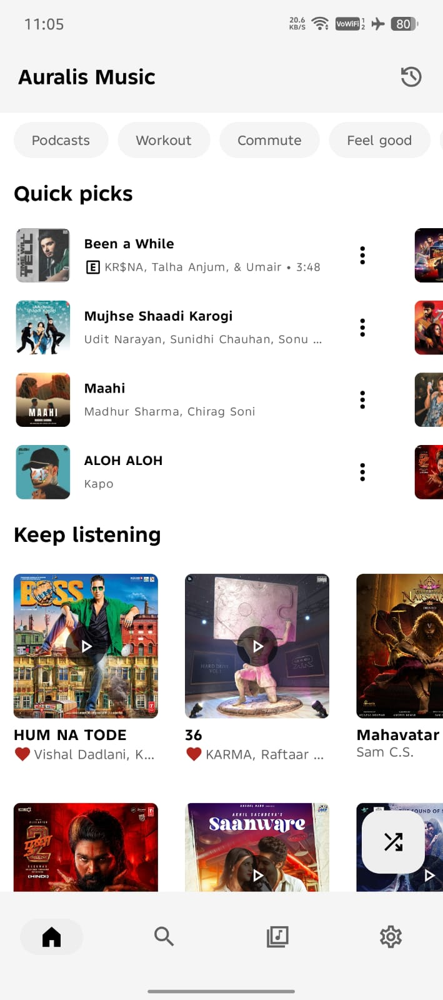
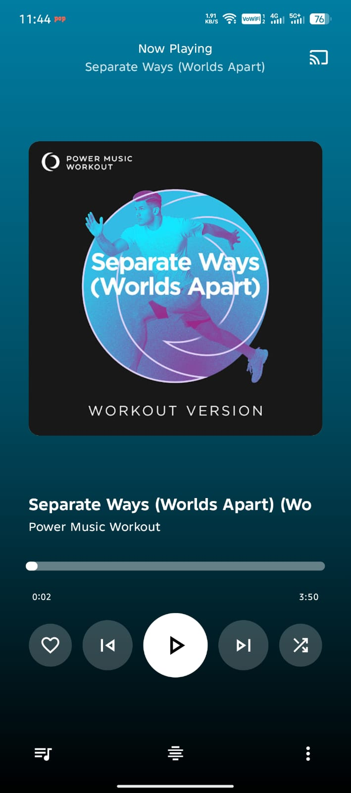
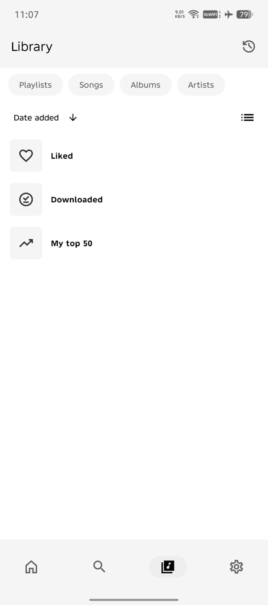
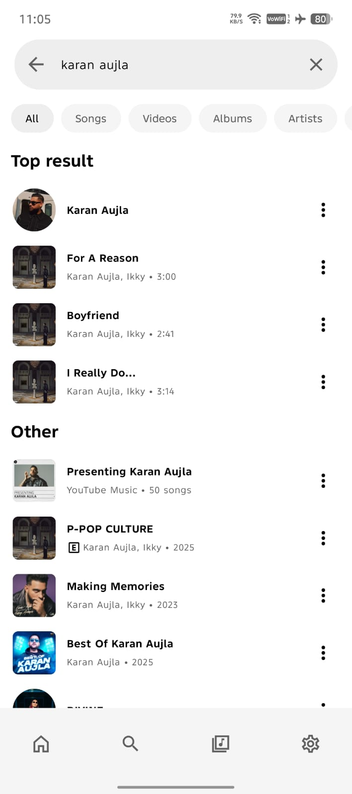

<div align="center">
  
  <h1>Auralis Music</h1>
  <p><strong>A robust, open-source music streaming client offering an ad-free experience, offline capabilities, and advanced music discovery.</strong></p>

  <a href="https://auralismusic.vercel.app/"></a>
  <br>
  <a href="https://github.com/iankr347-commits/AuralisMusic10/releases"></a>
</div>

---

## Overview

Auralis Music is designed to provide a seamless and premium music listening experience. It leverages the vast library of YouTube Music while eliminating advertisements and adding powerful features such as offline downloads, real-time lyrics, and environment-aware music recognition.


## Screenshots

### Mobile
<div align="center">
  
  
  
  
</div>


## Features

### Streaming and Playback
*   **Ad-Free Experience:** Stream music without interruptions from advertisements.
*   **seamless Playback:** seamless songs Playback.
*   **Background Playback:** Continue listening while using other applications or when the screen is off.
*   **Offline Mode:** Download tracks, albums, and playlists for offline listening with a dedicated download manager.

### Discovery
*   **Smart Recommendations:** Receive personalized song suggestions based on your listening history and preferences whit ai mode(beta).
*   **Comprehensive Browsing:** Explore Charts, Podcasts, Moods, and Genres to discover new music.

### Advanced Capabilities
*   **Synchronized Lyrics:** View real-time synced lyrics.
*   **Sleep Timer:** Configure automatic playback cessation after a specified duration.
*   **Cross-Device Support:** Cast content to Chromecast-enabled devices compatible network speakers and TVs.
*   **Data Import:** Import playlists and library data from other services.

---

## Installation

### Option 1: Direct Download (APK)
Download the latest Android Package Kit (APK) from the [Releases Page](https://github.com/iankr347-commits/AuralisMusic10/releases/latest).

### Option 2: Build from Source
To build the application locally, follow these steps:

1.  **Clone the Repository**
    ```bash
    git clone https://github.com/iankr347-commits/AuralisMusic10.git
    cd Auralismusic10
    ```

2.  **Configure Android SDK**
    Create a `local.properties` file and define your SDK path:
    ```bash
    echo "sdk.dir=/path/to/your/android/sdk" > local.properties
    ```

3.  **Firebase Configuration**
    Firebase setup is required for analytics and reliable imports. Please refer to [FIREBASE_SETUP.md](FIREBASE_SETUP.md) for detailed instructions on adding your `google-services.json`.

4.  **Build**
    Execute the Gradle build command:
    ```bash
    ./gradlew assembleFossDebug
    ```


---

##Disclaimer

This project and its contents are not affiliated with, funded, authorized, endorsed by, or in any way associated with YouTube, Google LLC, or any of its affiliates and subsidiaries. Any trademark, service mark, trade name, or other intellectual property rights used in this project are owned by the respective owners.

Auralis music is an open-source project created for educational and personal use. Users are responsible for ensuring their usage complies with YouTube's Terms of Service and applicable laws in their jurisdiction.

---
<div align="center">
    Licensed under <a href="LICENSE">GPL-3.0</a>
</div>

